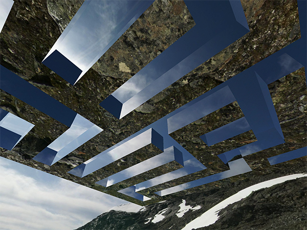

  

# BinaryThree



  Working repo for Maze development using THREE.js and Binary Tree Mazes. Basic concepts and experiments in motion and interaction - WIP repo use at your own risk.

  ```
  import * as THREE from 'three'; // build/three.js from node_module/three
  window.THREE = THREE;
  require('three/examples/js/controls/OrbitControls.js');
  require('three/examples/js/shaders/FresnelShader');
  // ...etc for other items like Render Passes and Shaders
  ```

Application start point --> ```index.js``` --> (load render file) ```Render.js```

## Run the example
  Requires Node v7.0.0 or greater

```bash
$ yarn install
$ yarn dev & open http://localhost:2020
```

## License

[MIT]
